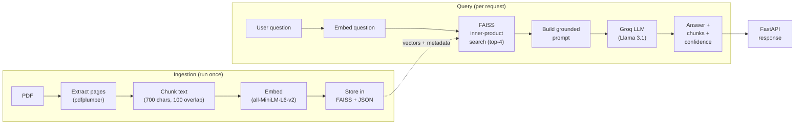

# Architecture

## Pipeline Overview

This project implements a classic **Retrieval-Augmented Generation (RAG)** pipeline. Instead of asking the LLM to answer from its general training data, we force it to answer only from the specific content of the Agentic AI ebook. This eliminates hallucination for questions within the ebook's scope.

The pipeline has two phases:

1. **Ingestion (offline, run once):** The PDF is downloaded, its text is extracted page-by-page, split into overlapping chunks, embedded into vectors using a local sentence-transformers model, and stored in a FAISS index alongside a JSON metadata file.

2. **Query (online, per request):** When a user sends a question, the question is embedded with the same model, FAISS returns the top-4 most similar chunks via inner-product search (equivalent to cosine similarity on normalised vectors), and those chunks are passed as context to Groq's Llama 3.1 model with a strict "answer only from the context" system prompt. The response, along with the supporting chunks and a confidence score, is returned to the user via FastAPI.

## Flow Diagram

## Key Design Decisions

| Decision | Rationale |
|----------|-----------|
| **FAISS (local, in-process)** | Zero external dependencies — no Docker, no cloud signup. Index + metadata persisted to disk as files. Pre-built wheels available for all platforms. |
| **IndexFlatIP + L2 normalisation** | Inner product on L2-normalised vectors equals cosine similarity. Simple, exact search — no approximate indexing needed for ~100-200 chunks. |
| **Bring-your-own vectors** | Embeddings are generated in Python with sentence-transformers and passed to FAISS manually. |
| **Overlapping chunks** | A sentence at a chunk boundary would be split without overlap. The 100-char overlap preserves context continuity. |
| **Batch embedding** | One `model.encode(all_texts)` call instead of N individual calls. Same O(n) complexity but much lower wall-clock time. |
| **Strict grounding prompt** | The LLM is instructed to answer *only* from the provided context and to say so explicitly if the answer isn't there. This minimises hallucination. |
| **Confidence = avg similarity** | A simple retrieval-quality proxy. Not a true faithfulness metric, but reasonable for a first iteration. |
| **LangGraph** | Even though the graph is linear (retrieve → generate), using LangGraph makes it trivial to add nodes later (e.g., a reranker, a hallucination checker) without restructuring the code. |
